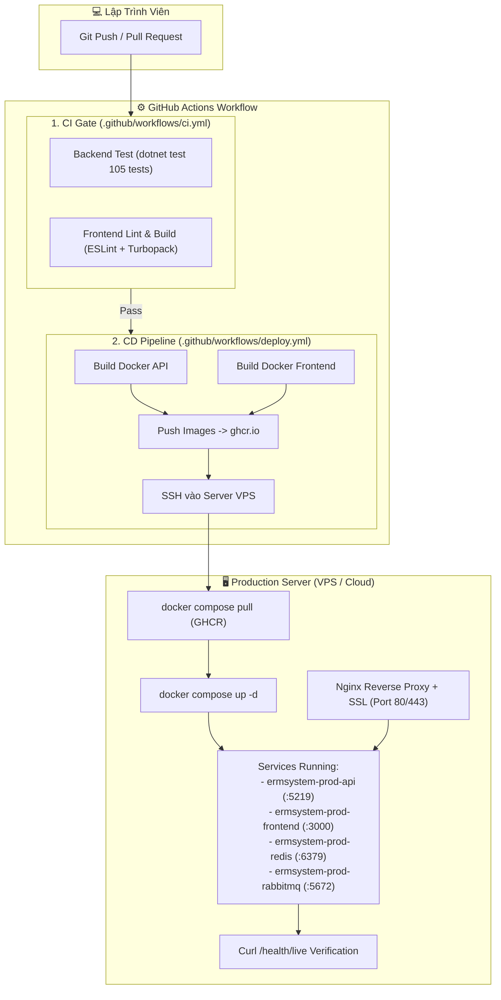

# HƯỚNG DẪN TRIỂN KHAI CI/CD TOÀN DIỆN CHO ERM SYSTEM
> **Dự án:** ERM Hospital Management System (Clean Architecture)  
> **Nền tảng:** GitHub Actions, Docker, GitHub Container Registry (GHCR), VPS Linux (Ubuntu / Debian)

---

## 🏗️ 1. TỔNG QUAN KIẾN TRÚC CI/CD



---

## 📋 2. DANH SÁCH WORKFLOW TRONG DỰ ÁN

| File Workflow | Trigger | Chức năng |
| :--- | :--- | :--- |
| [`.github/workflows/ci.yml`](file:///.github/workflows/ci.yml) | Mọi branch khi push / PR | Chạy `dotnet test` (105 tests) + `npm run lint` + `npm run build`. |
| [`.github/workflows/deploy.yml`](file:///.github/workflows/deploy.yml) | Push vào `main` hoặc chạy thủ công | Build Docker images -> Push lên GHCR -> SSH vào VPS deploy tự động. |
| [`docker-compose.prod.yml`](file:///docker-compose.prod.yml) | Môi trường Production | Chạy các container API, FE, Redis, RabbitMQ với cấu hình bảo mật. |

---

## 🔑 3. CÁC GITHUB SECRETS CẦN THIẾT LẬP

Truy cập repository GitHub: **Settings** -> **Secrets and variables** -> **Actions** -> **New repository secret**:

| Tên Secret | Bắt buộc | Ví dụ / Ý nghĩa |
| :--- | :---: | :--- |
| `SSH_HOST` | Có | Địa chỉ IP công khai của VPS (VD: `103.142.x.x`). |
| `SSH_USER` | Có | Username đăng nhập VPS (VD: `ubuntu` hoặc `root`). |
| `SSH_KEY` | Có | Khóa riêng tư SSH (Nội dung file `~/.ssh/id_rsa`). |
| `SSH_PORT` | Không | Cổng SSH nếu khác 22 (mặc định: `22`). |
| `ERM_HOSPITAL_DB_CONNECTION_STRING` | Có | Connection string MSSQL Production (có mã hóa TLS). |
| `JWT_SECRET_KEY` | Có | Khóa JWT bí mật Production tối thiểu 32 ký tự (256-bit). |
| `PROD_API_PUBLIC_URL` | Không | URL API công khai của FE (VD: `https://api.yourdomain.com/api`). |
| `FRONTEND_PUBLIC_URL` | Không | URL Frontend cho CORS (VD: `https://yourdomain.com`). |
| `REDIS_PASSWORD` | Không | Mật khẩu bảo vệ Redis Production. |
| `RABBITMQ_USER` | Không | Tài khoản RabbitMQ Production. |
| `RABBITMQ_PASSWORD` | Không | Mật khẩu RabbitMQ Production. |

---

## 🚀 4. HƯỚNG DẪN 4 BƯỚC SETUP SERVER VPS

### Bước 1: Cài đặt Docker & Docker Compose trên VPS (Ubuntu 22.04 / 24.04)

Chạy các lệnh sau trên terminal của VPS:

```bash
# Cập nhật hệ thống
sudo apt update && sudo apt upgrade -y

# Cài đặt Docker engine
curl -fsSL https://get.docker.com -o get-docker.sh
sudo sh get-docker.sh

# Cấp quyền docker cho user hiện tại (tránh cần sudo)
sudo usermod -aG docker $USER
newgrp docker

# Kiểm tra phiên bản
docker --version
docker compose version
```

### Bước 2: Tạo cặp SSH Key để GitHub Actions kết nối vào VPS

Trên máy cá nhân (hoặc VPS):

```bash
# Tạo SSH keypair không mật khẩu để CI tự động kết nối
ssh-keygen -t rsa -b 4096 -C "github-actions-deploy" -f ~/.ssh/github_actions_key -N ""

# Thêm public key vào danh sách authorized_keys trên VPS
cat ~/.ssh/github_actions_key.pub >> ~/.ssh/authorized_keys
chmod 600 ~/.ssh/authorized_keys

# Copy toàn bộ nội dung file private key để dán vào GitHub Secret (SSH_KEY):
cat ~/.ssh/github_actions_key
```

### Bước 3: Cấu hình Tường lửa (Firewall UFW) trên VPS

```bash
sudo ufw allow 22/tcp    # SSH
sudo ufw allow 80/tcp    # HTTP (Nginx)
sudo ufw allow 443/tcp   # HTTPS (Nginx)
sudo ufw enable
```

### Bước 4: Cấu hình Nginx Reverse Proxy & SSL Miễn phí (HTTPS)

Cài đặt Nginx và Certbot:

```bash
sudo apt install nginx certbot python3-certbot-nginx -y
```

Tạo file cấu hình Nginx `/etc/nginx/sites-available/ermsystem`:

```nginx
# Cấu hình Frontend (Domain chính)
server {
    server_name erm.yourdomain.com;

    location / {
        proxy_pass http://localhost:3000;
        proxy_http_version 1.1;
        proxy_set_header Upgrade $http_upgrade;
        proxy_set_header Connection 'upgrade';
        proxy_set_header Host $host;
        proxy_cache_bypass $http_upgrade;
    }
}

# Cấu hình Backend API
server {
    server_name api-erm.yourdomain.com;

    location / {
        proxy_pass http://localhost:5219;
        proxy_http_version 1.1;
        proxy_set_header Host $host;
        proxy_set_header X-Real-IP $remote_addr;
        proxy_set_header X-Forwarded-For $proxy_add_x_forwarded_for;
        proxy_set_header X-Forwarded-Proto $scheme;
    }
}
```

Kích hoạt cấu hình và cấp chứng chỉ SSL:

```bash
sudo ln -s /etc/nginx/sites-available/ermsystem /etc/nginx/sites-enabled/
sudo nginx -t
sudo systemctl reload nginx

# Cấp chứng chỉ HTTPS miễn phí tự động gia hạn
sudo certbot --nginx -d erm.yourdomain.com -d api-erm.yourdomain.com
```

---

## 🔄 5. QUY TRÌNH TRIGGER & KIỂM TRA DEPLOYMENT

1. **Trigger tự động qua Git Push:**
   ```bash
   git add .
   git commit -m "feat: release new hospital module"
   git push origin main
   ```
2. **Kiểm tra tiến độ trên GitHub:**
   * Vào tab **Actions** trên repository GitHub.
   * Xem tiến trình `Verify Tests & Lints` -> `Build & Push Docker Images` -> `Deploy to Production Server`.
3. **Kiểm tra trạng thái hệ thống trên VPS:**
   ```bash
   cd ~/ermsystem
   docker compose -f docker-compose.prod.yml ps
   docker compose -f docker-compose.prod.yml logs -f api
   ```
4. **Kiểm tra Healthcheck:**
   ```bash
   curl http://localhost:5219/health/live
   curl http://localhost:5219/health/ready
   ```

---

## 🛠️ 6. KỊCH BẢN ROLLBACK KHI CÓ SỰ CỐ

Nếu bản deploy mới phát sinh lỗi, bạn có thể rollback về bản trước đó trong 1 lệnh duy nhất:

```bash
cd ~/ermsystem

# Xem lịch sử image sha đã tải về
docker images

# Sửa file .env đổi IMAGE_TAG thành commit SHA của phiên bản ổn định trước đó:
# IMAGE_TAG=<commit_sha_truoc_do>

# Khởi chạy lại container
docker compose -f docker-compose.prod.yml up -d
```
