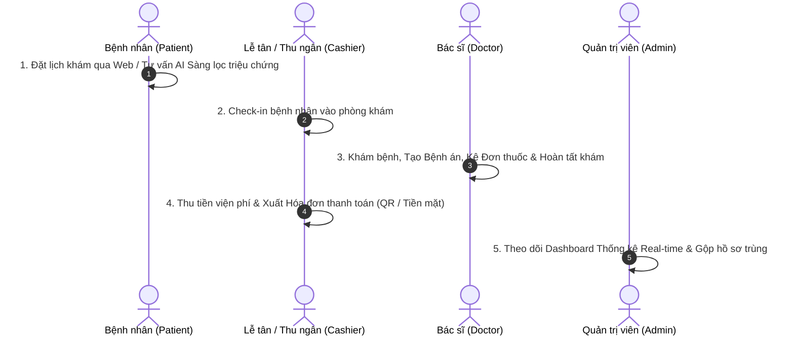

# KỊCH BẢN & HƯỚNG DẪN KHỞI CHẠY DEMO HỆ THỐNG ERM SYSTEM
> **Tài liệu hướng dẫn trình diễn Trọn vẹn Luồng Nghiệp vụ trước Hội đồng Đánh giá / Hội đồng Trường**  
> **Hệ thống:** ERM Hospital System (Electronic Medical Record & Hospital Management System)  
> **Cập nhật ngày:** 11/08/2026

---

## 📸 TỔNG QUAN LUỒNG DEMO (DEMO OVERVIEW)

Buổi trình diễn sẽ đi qua **5 luồng nghiệp vụ khép kín** (End-to-End Workflow) tương ứng với 4 tác nhân chính trong môi trường bệnh viện:



---

## 🛠️ CHUẨN BỊ MÔI TRƯỜNG & KHỞI CHẠY HỆ THỐNG

### 1. Yêu cầu Tiền đề (Prerequisites)
- **SDK & Runtime:** .NET 10 SDK, Node.js 22+ (npm), Git
- **Database:** SQL Server (Localhost hoặc SQL Express)
- **Tùy chọn (Optional):** Ollama (nếu demo AI local), Docker Desktop (nếu demo Redis/RabbitMQ)

---

### 2. Khởi chạy 3 Bước Chi tiết (Step-by-Step Launch)

#### 🔹 **Bước 1: Khởi tạo Database & Seed Dữ liệu mẫu (Full Test Dataset)**
Mở **PowerShell** tại thư mục gốc dự án `d:\ERMSystem` và chạy script tạo database và seed dữ liệu chuẩn:

```powershell
.\Infrastructure\database\bootstrap_full_test_dataset.ps1 -ServerInstance "localhost\MSSQLSERVER01"
```
*(Thay `"localhost\MSSQLSERVER01"` bằng tên SQL Server của bạn nếu khác)*

> [!NOTE]
> Script này sẽ tự động khởi tạo lại DB `ERMSystemHospitalDb`, seed toàn bộ Bác sĩ, Bệnh nhân, Lịch hẹn, Bệnh án, Thuốc, Hóa đơn và các Tài khoản Demo chuẩn.

---

#### 🔹 **Bước 2: Khởi chạy Backend ASP.NET Core API**
Mở **Terminal 1** tại thư mục gốc `d:\ERMSystem`:

```powershell
dotnet run --project BackE\ERMSystem.API\ERMSystem.API.csproj --urls http://localhost:5219
```

- **API Endpoint:** `http://localhost:5219`
- **Kiểm tra trạng thái:** `http://localhost:5219/health/live` (Báo `Healthy`)
- **Tài liệu API (OpenAPI/Scalar):** Truy cập `http://localhost:5219/scalar/v1` trên trình duyệt.

---

#### 🔹 **Bước 3: Khởi chạy Frontend Next.js Web App**
Mở **Terminal 2** chuyển vào thư mục `FontE`:

```powershell
cd FontE
npm run dev
```

- **Địa chỉ Frontend:** `http://localhost:3000`

---

## 🔑 DANH SÁCH TÀI KHOẢN DEMO (DEMO ACCOUNTS)

> 💡 **Mật khẩu chung cho tất cả tài khoản test:** `123456`

| Vai trò (Role) | Tên đăng nhập (Username) | Mục đích Demo |
| :--- | :--- | :--- |
| **Bệnh nhân (Patient)** | `patient00` hoặc `patient01` | Đặt lịch, Xem lịch sử khám, Đơn thuốc & Hóa đơn |
| **Lễ tân / Thu ngân (Cashier)** | `cashier00` hoặc `cashier01` | Check-in lịch hẹn, Thanh toán hóa đơn, Xuất hóa đơn |
| **Bác sĩ (Doctor)** | `doctor00` hoặc `doctor01` | Tiếp nhận bệnh nhân, Tạo bệnh án, Kê đơn thuốc |
| **Quản trị viên (Admin)** | `admin00` | Quản trị Dashboard, Thống kê Doanh thu, Gộp bệnh nhân trùng |

---

## 🎬 KỊCH BẢN TRÌNH DIỄN CHI TIẾT TRƯỚC HỘI ĐỒNG (DEMO SCRIPT)

### 📍 **GIAI ĐOẠN 1: TRẢI NGHIỆM BỆNH NHÂN & AI SÀNG LỌC TRIỆU CHỨNG**
*(Thực hiện tại Trình duyệt: `http://localhost:3000`)*

1. **Trang chủ & Tra cứu:**
   - Trình bày giao diện Trang chủ công khai: Giới thiệu Bệnh viện, Danh mục Chuyên khoa (Tim mạch, Thần kinh, Nhi khoa...), Danh sách Bác sĩ nổi bật.
2. **AI Chatbot Sàng lọc Triệu chứng (Smart AI Assistant):**
   - Click vào ô Chatbot AI ở góc màn hình.
   - Nhập câu hỏi thử nghiệm: `"Tôi bị sốt nhẹ, ho đắng họng 2 ngày nay thì nên khám khoa nào?"`
   - *Điểm nhấn Hội đồng:* Thể hiện khả năng **AI Sàng lọc triệu chứng** (tích hợp Ollama Local hoặc Fallback RAG chuyên khoa nội bộ), đưa ra lời khuyên ban đầu và gợi ý đặt lịch với Bác sĩ phù hợp.
3. **Đặt lịch khám trực tuyến (Online Booking):**
   - Chọn Chuyên khoa & Chọn Bác sĩ (VD: `Dr. John Doe`).
   - Chọn Ngày khám (Hôm nay hoặc ngày mai) và chọn Khung giờ khám.
   - Điền thông tin đăng ký khám -> Nhấn **Đặt lịch hẹn**.
4. **Cổng thông tin Bệnh nhân (Patient Portal):**
   - Đăng nhập tài khoản Bệnh nhân (`patient00` / pass: `123456`).
   - Vào mục **Lịch hẹn của tôi** -> Thấy trạng thái lịch hẹn mới vừa tạo ở dạng `Pending` (Chờ tiếp đón).

---

### 📍 **GIAI ĐOẠN 2: LỄ TÂN CHECK-IN & TIẾP ĐÓN BỆNH NHÂN**
*(Chuyển sang Đăng nhập tài khoản Lễ tân: `cashier00`)*

1. **Danh sách Lịch hẹn trong ngày (Today Appointments Worklist):**
   - Mở màn hình Lễ tân / Tiếp đón.
   - Thấy ngay Lịch hẹn mới của bệnh nhân vừa đăng ký.
2. **Thực hiện Check-in:**
   - Nhấn nút **Check-in** bệnh nhân. Trạng thái lịch hẹn được cập nhật sang danh sách sẵn sàng khám của Bác sĩ.

---

### 📍 **GIAI ĐOẠN 3: BÁC SĨ KHÁM BỆNH - TẠO BỆNH ÁN & KÊ ĐƠN THUỐC**
*(Chuyển sang Đăng nhập tài khoản Bác sĩ: `doctor00`)*

1. **Thông báo Real-time (Notification Bell):**
   - Bác sĩ nhận được thông báo biến động lịch khám hôm nay trên thanh Notification góc trên.
2. **Tiếp nhận Bệnh nhân:**
   - Chọn bệnh nhân từ danh sách chờ khám.
3. **Tạo Hồ sơ Bệnh án (Medical Record):**
   - Nhập **Triệu chứng (Symptoms):** `"Sốt 38.5 độ, ho hắng, đau rát họng, mệt mỏi"`
   - Nhập **Chẩn đoán (Diagnosis):** `"Viêm họng cấp / Cúm A"`
   - Nhập **Ghi chú điều trị (Notes):** `"Nghỉ ngơi, uống nhiều nước, tái khám sau 5 ngày nếu không giảm sốt"`
4. **Kê Đơn thuốc (Prescription):**
   - Tìm kiếm thuốc từ Danh mục Thuốc (Ví dụ: *Paracetamol 500mg*, *Amoxicillin 500mg*).
   - Nhập **Liều dùng (Dosage):** `"Uống 1 viên / lần x 2 lần / ngày (sau ăn)"`
   - Nhập **Thời gian (Duration):** `"5 ngày"`
   - Nhấn **Lưu đơn thuốc**.
5. **Hoàn tất Khám bệnh:**
   - Nhấn **Hoàn tất Lượt khám** -> Lịch hẹn tự động chuyển trạng thái `Completed`.

---

### 📍 **GIAI ĐOẠN 4: THU NGÂN THANH TOÁN HÓA ĐƠN VIỆN PHÍ**
*(Chuyển sang Tài khoản Thu ngân: `cashier00`)*

1. **Danh sách Hóa đơn (Billing Worklist):**
   - Mở giao diện Hóa đơn Viện phí. Hóa đơn mới tự động được hệ thống tổng hợp từ **Tiền khám + Chi phí Đơn thuốc**.
2. **Chi tiết Hóa đơn & Thanh toán:**
   - Mở chi tiết hóa đơn: Kiểm tra Bảng kê tiền khám và các dòng thuốc.
   - Chọn Phương thức thanh toán: **Tiền mặt** hoặc **Mã QR Chuyển khoản (Mock QR Code)**.
   - Nhấn **Xác nhận Thanh toán** -> Trạng thái Hóa đơn chuyển thành `Paid`. Xuất phiếu thu.

---

### 📍 **GIAI ĐOẠN 5: DASHBOARD QUẢN TRỊ & TÍNH NĂNG NÂNG CAO**
*(Chuyển sang Đăng nhập tài khoản Admin: `admin00`)*

1. **Dashboard Thống kê Thời gian thực (Real-time Analytics):**
   - Trình bày các thẻ chỉ số KPI:
     - **Tổng số bệnh nhân** trong hệ thống.
     - **Số lượt khám hôm nay**, **Tỷ lệ hoàn thành khám (%)**, **Tỷ lệ hủy (%)**.
     - **Tỷ lệ thu hồi nợ / Doanh thu thu thực tế trong tháng**.
     - **Top 5 Bệnh lý phổ biến nhất** (Cập nhật trực tiếp từ chẩn đoán của Bác sĩ).
   - Biểu đồ Xu hướng (Trends Chart): Xem biểu đồ biến động theo Ngày (Daily) và theo Tháng (Monthly).
2. **Demo Tính năng Nâng cao - Phát hiện & Gộp Bệnh nhân Trùng lặp (`MergePatientsAsync`):**
   - Trình diễn tìm kiếm bệnh nhân có nguy cơ trùng hồ sơ (Trùng Số điện thoại hoặc Trùng Tên + Ngày sinh).
   - Thực hiện **Gộp 2 hồ sơ bệnh nhân**: Hệ thống tự động chuyển toàn bộ Lịch sử Lịch hẹn, Đơn thuốc từ Bệnh nhân nguồn sang Bệnh nhân đích, giữ liên kết Tài khoản và tự động ghi **Compliance Audit Log** phục vụ kiểm toán an toàn dữ liệu.

---

## 🎯 CÂU HỎI THƯỜNG GẶP VÀ CÁCH TRẢ LỜI HỘI ĐỒNG (Q&A PREPARATION)

> ❓ **Hội đồng hỏi 1: Hệ thống xử lý thế nào nếu hạ tầng Redis / RabbitMQ / Ollama bị tắt hoặc gặp sự cố?**  
> 💡 **Trả lời:**  
> Hệ thống được thiết kế theo nguyên tắc **Graceful Fallback & High Availability**:
> - Nếu Redis tắt: Hệ thống tự động fallback về **In-Memory Cache**.
> - Nếu RabbitMQ tắt: Hệ thống tự động xử lý event đồng bộ (Synchronous in-process eventing).
> - Nếu Ollama AI tắt: Chatbot tự động chuyển sang cơ chế **Internal RAG Keyword Knowledge Base** để tư vấn chuyên khoa mà không gây ngắt đoạn trải nghiệm người dùng.

---

> ❓ **Hội đồng hỏi 2: Độ tin cậy và chính xác của Logic Nghiệp vụ backend được đảm bảo ra sao?**  
> 💡 **Trả lời:**  
> Toàn bộ tầng Application Service và Utilities của dự án đã được bao phủ bởi **89 Unit Tests tự động** (sử dụng xUnit & Moq framework), kiểm thử đầy đủ các trường hợp thành công, vi phạm ràng buộc và ngoại lệ nghiệp vụ. Kết quả kiểm thử đạt **100% PASSED (89/89 tests)**.

---

> ❓ **Hội đồng hỏi 3: Tính bảo mật và Phân quyền của hệ thống được triển khai như thế nào?**  
> 💡 **Trả lời:**  
> - **Xác thực:** JWT Access Token & Refresh Token mechanism, hỗ trợ Baseline MFA (Xác thực 2 yếu tố).
> - **Phân quyền:** Policy-based Authorization kết hợp Fine-grained Permissions (`AppPermissions`).
> - **Kiểm toán:** Ghi vết tự động mọi hành vi nhạy cảm (như Gộp bệnh nhân, Đổi mật khẩu) qua `IComplianceAuditRecorder`.

---

*Tài liệu kịch bản được soạn thảo sẵn sàng cho buổi bảo vệ đồ án / demo trước Hội đồng Trường.*
