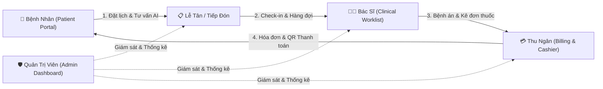

# ERM Hospital System — Hệ Thống Quản Lý Bệnh Viện & Bệnh Án Điện Tử

[](https://github.com/dangvanvietcompany-byte/ERMSystem_CleanAchitecture/actions/workflows/ci.yml)
[](https://github.com/dangvanvietcompany-byte/ERMSystem_CleanAchitecture/actions/workflows/deploy.yml)


---

## 🌟 1. TỔNG QUAN DỰ ÁN

**ERM Hospital System (Enterprise Electronic Record Management)** là giải pháp phần mềm toàn diện phục vụ quá trình chuyển đổi số y tế tại các bệnh viện tư nhân và phòng khám đa khoa hiện đại. Hệ thống kết hợp giữa kiến trúc **Clean Architecture** ở Backend (.NET 10) và nền tảng **Modern Web** ở Frontend (Next.js 16 Turbopack), mang lại hiệu năng cao, tính sẵn sàng và độ bảo mật chuẩn doanh nghiệp y tế.

Hệ thống số hóa toàn bộ vòng đời tiếp nhận và điều trị của bệnh nhân thông qua 4 phân hệ chính:



### 🎯 4 Tác Nhân & Phân Hệ Trọng Tâm

* 🏥 **Bệnh nhân (Public Portal & Patient Portal):**
  * Tra cứu thông tin dịch vụ, chuyên khoa, đội ngũ bác sĩ và bảng giá công khai.
  * Đặt lịch hẹn khám bệnh trực tuyến theo khung giờ khám của bác sĩ.
  * **Trợ lý AI Sàng lọc triệu chứng y khoa:** Hỗ trợ người bệnh giải đáp triệu chứng ban đầu, gợi ý chuyên khoa phù hợp (chạy hoàn toàn cục bộ bảo vệ quyền riêng tư).
  * Cổng tra cứu cá nhân: Xem hồ sơ bệnh án điện tử, chi tiết đơn thuốc, kết quả khám và quét mã QR thanh toán viện phí trực tuyến.

* 👨‍⚕️ **Bác sĩ (Doctor Clinical Workspace):**
  * Hàng đợi ca khám thông minh (Doctor Worklist): Theo dõi danh sách bệnh nhân đã check-in theo thời gian thực.
  * Hồ sơ bệnh án điện tử (EMR): Ghi nhận sinh hiệu (mạch, huyết áp, SpO2, BMI), bệnh sử, chẩn đoán mã ICD-10.
  * Chỉ định Cận lâm sàng: Xét nghiệm máu, chẩn đoán hình ảnh (X-quang, Siêu âm, CT).
  * **An toàn Kê đơn thuốc (Drug Safety Engine):** Tự động phát hiện và cảnh báo tương tác thuốc nguy hiểm (Warfarin, NSAID, ACEi/ARB, Opioid...), phát hiện trùng lặp nhóm điều trị và chống chỉ định bệnh lý đặc thù (G6PD, Nhược cơ, Gout).

* 💳 **Lễ tân & Thu ngân (Cashier & Billing Management):**
  * Tiếp đón người bệnh, check-in vào phòng khám, cấp số thứ tự vào hàng chờ.
  * Tự động tổng hợp chi phí ca khám thành Hóa đơn viện phí (tiền khám, cận lâm sàng, thuốc).
  * Hỗ trợ đa dạng phương thức thanh toán: Tiền mặt, Cổng thanh toán trực tuyến (VNPay/QR Pay mô phỏng).
  * Báo cáo doanh thu, đối soát giao dịch và hoàn tất hồ sơ tài chính.

* 🛡️ **Quản trị viên (Administration & Analytics):**
  * Dashboard thống kê thời gian thực: Lưu lượng khám, tỷ lệ hoàn tất ca khám, doanh thu theo chuyên khoa và công nợ.
  * Quản trị người dùng & Phân quyền chi tiết (RBAC) với 21 Permission Policies độc lập.
  * **Thuật toán khử trùng lặp hồ sơ (Patient Deduplication):** Tự động phát hiện và hỗ trợ gộp hồ sơ bệnh nhân bị trùng thông tin căn cước, số điện thoại hoặc mã BHYT.
  * Giám sát bảo mật, nhật ký đăng nhập (Audit Log) và cấu hình cảnh báo vận hành.

---

## 🏛️ 2. KIẾN TRÚC & CÔNG NGHỆ ÁP DỤNG

### Backend (.NET 10 Clean Architecture)
* **Domain Layer:** Chứa Entities nghiệp vụ lõi, Enums, Constants và quy tắc lâm sàng (độc lập 100% với database và thư viện ngoài).
* **Application Layer:** Dịch vụ ca khám, kê đơn, viện phí, DTOs, cơ chế phân quyền theo phạm vi bác sĩ điều trị (`DoctorAccessScopeHelper`) và chuẩn hóa thời gian phòng khám (`ClinicDateTimeHelper`).
* **Infrastructure Layer:** SQL Server qua Entity Framework Core 10, Redis Distributed Cache, RabbitMQ Message Broker với mô hình **Transactional Outbox Pattern**, mã hóa mật khẩu BCrypt.
* **API Layer:** ASP.NET Core Web API, JWT Bearer Token, TOTP Multi-Factor Authentication (MFA), chuẩn hóa lỗi theo schema `ApiErrorResponse`, cơ chế Fail-Fast Startup Validation.

### Frontend (Next.js 16 Modern Web)
* **Framework:** Next.js 16.1.7 (App Router, Turbopack), React 19.2.3, TypeScript 5.
* **Styling & UI:** TailwindCSS v4, thiết kế bảng màu HSL hiện đại, hiệu ứng vi mô (micro-interactions), hỗ trợ responsive hoàn hảo trên mọi thiết bị.
* **Đa ngôn ngữ (i18n):** Hệ thống song ngữ toàn diện Tiếng Việt 🇻🇳 và Tiếng Anh 🇬🇧 với bộ từ điển đồng bộ 100%.
* **Quản lý trạng thái:** Xử lý đầy đủ 4 trạng thái giao diện (Loading Skeleton, Empty State, Error State, Success State).

### Cơ sở dữ liệu (MSSQL Multi-Schema Segregation)
Dữ liệu được phân tách thành 8 schema biệt lập giúp quản lý phân quyền và tối ưu hiệu năng:
* `[identity]`: Người dùng, vai trò, phiên làm việc, refresh token, nhật ký bảo mật.
* `[org]`: Khoa phòng, chuyên khoa, phòng khám, hồ sơ nhân sự, lịch làm việc bác sĩ.
* `[patient]`: Hồ sơ bệnh nhân, tài khoản liên kết, định danh cá nhân, thẻ BHYT.
* `[scheduling]`: Khung giờ hẹn, lịch hẹn khám, check-in, phiếu xếp hàng.
* `[emr]`: Ca khám (Encounter), sinh hiệu, chẩn đoán, phiếu ghi lâm sàng, tệp đính kèm.
* `[pharmacy]`: Danh mục thuốc, đơn thuốc, chi tiết đơn, xuất cấp dược.
* `[billing]`: Bảng giá dịch vụ, hóa đơn, khoản mục hóa đơn, giao dịch thanh toán.
* `[audit]`: Hộp thư sự kiện (Outbox/Inbox), mẫu thông báo, lịch sử gửi tin.

### DevOps & CI/CD
* **Continuous Integration:** Pipeline GitHub Actions tự động chạy **105 Unit Tests** Backend và kiểm tra **ESLint** Frontend mỗi lần push code.
* **Continuous Deployment:** Tự động build Docker Image, tag phiên bản theo mã Git SHA và đẩy lên **GitHub Container Registry (GHCR)**.
* **Orchestration:** Hỗ trợ triển khai nhanh chóng qua Docker Compose cho cả môi trường Development và Production.

---

## 💻 3. YÊU CẦU MÔI TRƯỜNG & PHẦN MỀM CẦN THIẾT

* **Hệ điều hành:** Windows 10/11, macOS, hoặc Linux (Ubuntu 22.04+).
* **Git:** Phiên bản 2.40 trở lên.
* **.NET SDK:** Phiên bản **.NET 10.0 SDK**.
* **Node.js & npm:** Node.js **22.x LTS** trở lên, npm 10.x+.
* **Database:** Microsoft SQL Server (bản Local, Express hoặc Docker container).
* **Công cụ tùy chọn:**
  * **Docker Desktop:** Để chạy Redis, RabbitMQ hoặc chạy trọn gói dự án qua Docker Compose.
  * **Ollama:** Để trải nghiệm tính năng Trợ lý AI y tế cục bộ với model `llama3.1:8b`.

---

## 🚀 4. HƯỚNG DẪN CÀI ĐẶT & CHẠY DỰ ÁN TỪ MÃ NGUỒN

### Bước 1: Tải mã nguồn về máy
```bash
git clone https://github.com/dangvanvietcompany-byte/ERMSystem_CleanAchitecture.git
cd ERMSystem_CleanAchitecture
```

### Bước 2: Khởi tạo Cơ sở dữ liệu & Dữ liệu mẫu (Full Test Dataset)
Mở cửa sổ **PowerShell** tại thư mục gốc của dự án và chạy script tạo database:

```powershell
.\Infrastructure\database\bootstrap_full_test_dataset.ps1 -ServerInstance "localhost"
```
*(Nếu bạn dùng SQL Server Express, thay đổi tham số thành `-ServerInstance "localhost\SQLEXPRESS"`).*

Script tự động thực hiện:
* Khởi tạo Database `ERMSystemHospitalDb` với đầy đủ 8 schema chuẩn y tế.
* Thiết lập hệ thống bảng, khóa ngoại và chỉ mục tối ưu hóa truy vấn.
* Nạp sẵn bộ dữ liệu mẫu phong phú: 20 tài khoản Bác sĩ, 20 Thu ngân, 20 Quản trị viên, danh mục thuốc, dịch vụ, ca khám và hóa đơn.

---

### Bước 3: Khởi chạy Backend (.NET 10 API)
Mở terminal và di chuyển vào thư mục Backend:

```powershell
# Khôi phục packages và biên dịch dự án
dotnet restore BackE\ERMSystem.sln
dotnet build BackE\ERMSystem.sln

# Chạy Backend API trên cổng 5219
dotnet run --project BackE\ERMSystem.API\ERMSystem.API.csproj --urls http://localhost:5219
```

* **Địa chỉ API:** `http://localhost:5219`
* **Kiểm tra Healthcheck:** Mở trình duyệt truy cập `http://localhost:5219/health/live` (kết quả `Healthy`).
* **Tài liệu API (Scalar/OpenAPI):** Tự động kích hoạt tại `http://localhost:5219/scalar/v1` khi ở môi trường Development.

---

### Bước 4: Khởi chạy Frontend (Next.js 16)
Mở một cửa sổ terminal mới và khởi động giao diện người dùng:

```powershell
cd FontE
npm install
npm run dev
```

* **Địa chỉ ứng dụng:** `http://localhost:3000`
* Giao diện sẽ tự động kết nối với Backend API tại `http://localhost:5219/api`.

---

### Bước 5: (Tùy chọn) Kích hoạt Trợ lý AI Sàng lọc triệu chứng y khoa
Hệ thống tích hợp sẵn Knowledge Base y khoa nội bộ làm phương án dự phòng. Để sử dụng mô hình ngôn ngữ lớn (LLM) thực sự:

1. Tải và cài đặt [Ollama](https://ollama.com).
2. Tải model y khoa về máy:
   ```bash
   ollama pull llama3.1:8b
   ollama run llama3.1:8b
   ```
3. Tính năng tư vấn AI trên cổng bệnh nhân sẽ tự động kết nối tới Ollama tại `http://localhost:11434`.

---

## 🐳 5. KHỞI CHẠY BẰNG DOCKER COMPOSE (NHANH CHÓNG)

Nếu máy tính của bạn đã cài sẵn Docker Desktop, bạn có thể khởi chạy toàn bộ hệ sinh thái (Frontend, Backend, Redis, RabbitMQ) chỉ với 1 câu lệnh duy nhất tại thư mục gốc:

```bash
docker compose up --build -d
```

* **Frontend:** `http://localhost:3000`
* **Backend API:** `http://localhost:5219`
* **RabbitMQ Dashboard:** `http://localhost:15672` (Tài khoản: `guest` / Mật khẩu: `guest`)
* **Redis Cache:** `localhost:6379`

---

## 👥 6. TÀI KHOẢN ĐĂNG NHẬP DÙNG THỬ (DEMO ACCOUNTS)

Tất cả tài khoản mẫu trong hệ thống đều có mật khẩu mặc định là: **`123456`**

| Vai Trò (Role) | Tên Đăng Nhập Mẫu | Phạm Vi Quyền Hạn |
| :--- | :--- | :--- |
| **Quản trị viên (Admin)** | `admin00` hoặc `admin01` | Toàn quyền quản trị nhân sự, cấu hình hệ thống, xem dashboard phân tích. |
| **Bác sĩ (Doctor)** | `doctor00` hoặc `doctor01` | Tiếp nhận ca khám, ghi bệnh án, chỉ định xét nghiệm, kê đơn thuốc. |
| **Thu ngân (Cashier)** | `cashier00` hoặc `cashier01` | Check-in bệnh nhân, quản lý hóa đơn viện phí, thu tiền và đối soát. |
| **Bệnh nhân (Patient)** | `patient00` hoặc `patient01` | Đặt lịch hẹn, tra cứu bệnh án cá nhân, đơn thuốc và thanh toán QR. |

---

## 🧪 7. QUY TRÌNH KIỂM THỬ TỰ ĐỘNG (AUTOMATED TESTING)

Trước khi commit mã nguồn, bạn có thể chạy toàn bộ các bài kiểm thử tự động tại máy cục bộ:

```powershell
# Chạy toàn bộ 105 Unit Tests Backend
dotnet test BackE\ERMSystem.sln --verbosity normal

# Kiểm tra Linter và Typescript trên Frontend
cd FontE
npm run lint
npm run build
```

Mọi thay đổi khi đẩy lên nhánh `main` đều được giám sát bởi hệ thống CI/CD tại [`.github/workflows/`](file:///.github/workflows/) nhằm đảm bảo chất lượng phần mềm không bao giờ bị suy giảm.

---

## 📄 8. GIẤY PHÉP & TÁC QUYỀN

Dự án được xây dựng và phát triển phục vụ mục đích nghiên cứu, học thuật và trình diễn đồ án tốt nghiệp công nghệ phần mềm. Mọi đóng góp và phản hồi xin vui lòng liên hệ qua GitHub Issues hoặc Pull Requests.
